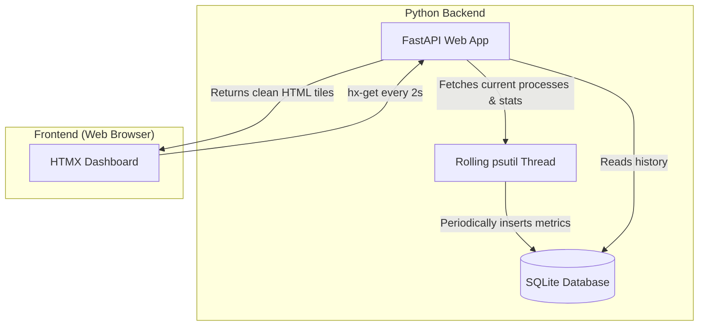

# ByteWatch 🖥️

ByteWatch is a premium, high-fidelity hardware telemetry dashboard. It monitors active resource utilization on your system, logs metrics in real-time, and displays them via a modern visual interface that requires zero heavy JavaScript libraries or trackers.

---

## ✨ Features

- 🕒 **Real-Time Polling**: Drives live dashboard updates every 2 seconds using **HTMX** linear swaps with zero custom heavy JS listeners.
- 🌓 **Dual-Theme Design**: Sleek, glassmorphic Cyber-Neon Dark Theme (default) and high-contrast, premium soft slate Light Theme, with selections persisted in `localStorage`.
- 📊 **Resource Analytics**: Captures precise live CPU core statistics, system load averages, clock speeds, and memory consumption.
- 🗃️ **Self-Pruning SQLite Logs**: Stores telemetry values to a local database (`bytewatch.db`) with an automated rolling cleanup thread that prunes records older than 30 minutes to maintain an ultra-lightweight footprint.
- ⚡ **Process Inspector**: Fetches and sorts the Top 15 resource-intensive system threads by CPU load, highlighting high-utilization processes dynamically.
- 🚀 **Pre-rendered Load State**: Renders telemetry values instantly on the very first page request to prevent blank screen delays before the initial 2-second poll triggers.

---

## 🛠️ Technology Stack

- **Backend**: [FastAPI](https://fastapi.tiangolo.com/) (Asynchronous Web Framework)
- **Telemetry**: [psutil](https://psutil.readthedocs.io/en/latest/) (System Metrics Interface)
- **Database**: [SQLite](https://www.sqlite.org/index.html) (Single-file SQL engine)
- **Frontend**: [HTMX](https://htmx.org/) (High-speed HTML swaps)
- **Styling**: Vanilla CSS (Responsive variables and modern glassmorphism layouts)

---

## 📂 Project Structure

```text
bytewatch/
├── static/
│   └── style.css         # Modern styling rules (variable sheets & responsive layouts)
├── templates/
│   ├── index.html        # Main dashboard base template (head tags, toggle, inline scripts)
│   └── vitals.html       # Metric panels and process list tables (HTMX swap fragments)
├── database.py           # SQLite initialization, logging, and metrics auto-pruning
├── monitor.py            # Multithreaded psutil daemon telemetry engine
├── main.py               # FastAPI application, templates router, and server startup
├── .gitignore            # Excludes local databases, caches, and IDE profiles
└── README.md             # Project documentation (this file!)
```

---

## 🚀 Getting Started

### 📋 Prerequisites
Ensure you have **Python 3.8+** and **Git** installed on your system.

### 1. Clone the Project
```bash
git clone https://github.com/YOUR_USERNAME/ByteWatch.git
cd ByteWatch
```

### 2. Install Dependencies
Install all required libraries using pip:
```bash
pip install fastapi uvicorn psutil jinja2
```

### 3. Run the Server
Launch the server using Python:
```bash
python main.py
```

### 4. Open the Dashboard
Navigate to your web browser and access the live application:
👉 **[http://localhost:8000](http://localhost:8000)**

---

## ⚙️ Architecture



---

## ☁️ Vercel Deployment

ByteWatch is pre-configured to run out of the box in Serverless environments (like Vercel). 

### How it handles Serverless:
1. **Dynamic Pathing**: Automatically detects serverless environments and writes SQLite logs to `/tmp/bytewatch.db` (ephemeral writeable storage) instead of the read-only file system.
2. **On-Demand Polling**: Switches from rolling background threads (which are frozen in serverless contexts between requests) to high-speed synchronous querying of `psutil` data on demand per incoming page load or HTMX swap.

### Deploying to Vercel:
1. Make sure your project is committed to GitHub.
2. Log into your [Vercel Dashboard](https://vercel.com).
3. Click **Add New** -> **Project**.
4. Import your `ByteWatch` repository.
5. Vercel will automatically detect `vercel.json` and build the Python serverless functions.
6. Click **Deploy**!

---

## 📄 License
This project is open-source and available under the [MIT License](LICENSE).
